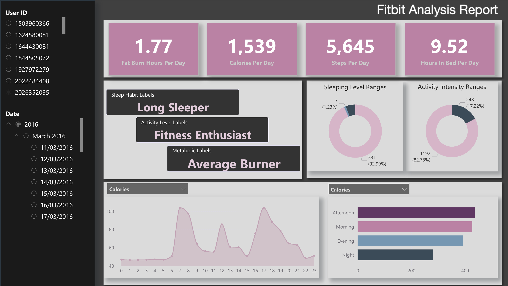

# FitBit Fitness Tracker Data Pipeline

A comprehensive data engineering project that processes FitBit fitness tracker data using Azure Databricks and Microsoft Fabric, implementing a medallion architecture (Bronze-Silver-Gold) for data transformation and analytics.

## Table of Contents

- [Project Architecture](#project-architecture)
- [Overview](#overview)
- [Data Source](#data-source)
- [Data Pipeline](#data-pipeline)
- [Great Expectations Data Quality](#great-expectations-data-quality)
- [Project Structure](#project-structure)
- [Getting Started](#getting-started)
- [Technologies Used](#technologies-used)

## Project Architecture




The project follows a modern data lakehouse architecture with the following components:

- **Azure Data Lake Storage (ADLS)**: Stores raw and processed data in different layers
- **Azure Databricks**: Performs data transformations using Spark Structured Streaming
- **Microsoft Fabric Lakehouse**: Provides analytics-ready data with shortcuts to ADLS
- **Microsoft Fabric Semantic Model**: Power BI semantic model for reporting
- **Power BI Reports**: Interactive dashboards for data visualization

## Overview

This project processes FitBit fitness data from multiple sources including calories, heart rate, steps, sleep, activity intensities, METs, and weight measurements. The pipeline implements a medallion architecture pattern to progressively refine data quality and structure:

1. **Bronze Layer**: Raw data ingestion with basic cleaning
2. **Silver Layer**: Cleaned and aggregated data with business logic
3. **Gold Layer**: Unified, analytics-ready datasets

## Data Source

**FitBit Fitness Tracker Data**
- **Source**: [Kaggle Dataset - FitBit Fitness Tracker Data](https://www.kaggle.com/datasets/arashnic/fitbit)
- **Description**: Comprehensive dataset containing minute-level and daily-level fitness tracker data from FitBit devices
- **Format**: CSV files

## Data Pipeline

The data pipeline follows a medallion architecture with five main stages:

### 1. Landing Zone (Raw Data)
- Location: `adls/landing/landing_zone/`
- CSV files from Kaggle dataset
- Monitored using Auto Loader (CloudFiles)

### 2. Bronze Layer (Raw Ingestion)
- **Purpose**: Ingest raw data from landing zone with minimal transformations
- **Location**: `adls/medallion/bronze/`
- **Process**:
  - Streams data using Spark Structured Streaming
  - Applies preprocessing (duplicate removal, null handling)
  - Adds metadata columns (load_time, source_file, timeKey)
  - **Great Expectations validation** integrated at ingestion
- **Tables**: `calories_min_bz`, `heartrate_sec_bz`, `intensities_min_bz`, `METs_min_bz`, `sleep_min_bz`, `steps_min_bz`, `weight_daily_bz`
- **Implementation**: `databricks/04_bronze.ipynb`

### 3. Silver Layer (Cleaned & Aggregated)
- **Purpose**: Clean, aggregate, and enrich data for analytics
- **Location**: `adls/medallion/silver/`
- **Process**:
  - Reads from Bronze layer using Delta Streaming
  - Applies aggregations and business logic
  - Uses MERGE operations for upsert logic
  - Processes in three stages for dependency management
- **Tables**: Daily aggregations (`calories_daily_sl`, `heartrate_daily_sl`, `intensities_daily_sl`, `sleep_daily_sl`, `steps_daily_sl`), minute-level (`heartrate_min_sl`), lookup tables (`user_list`, `date_list`)
- **Implementation**: `databricks/05_silver.ipynb`

### 4. Gold Layer (Analytics-Ready)
- **Purpose**: Create unified, business-ready datasets for analytics and reporting
- **Location**: `adls/medallion/gold/`
- **Process**:
  - Combines multiple Silver layer tables into unified fact table
  - Creates user-date grid from lookup tables
  - Uses foreachBatch for micro-batch processing
- **Tables**: `activity_daily_gold` (unified daily activity metrics)
- **Implementation**: `databricks/06_gold.ipynb`

### 5. Microsoft Fabric Integration

- **Lakehouse** (`fitbit_LH.Lakehouse/`): 
  - Creates shortcuts to ADLS Delta tables in the medallion layers
  - Provides unified access to Bronze, Silver, Gold, and Initial tables
  - Shortcuts configured in `shortcuts.metadata.json`
  
- **Semantic Model** (`fitbit_model.SemanticModel/`):
  - Power BI semantic model built using TMDL (Tabular Model Definition Language)
  - Includes table definitions, relationships, and calculated measures
  - Tables: calories_min, steps_min, heartrate_sec, heartrate_min, intensities_min, METs_min, sleep_min, weight_daily, user_list, date_list, and date tables
  - Supports DirectLake mode for real-time data access
  
- **Power BI Report** (`fitbit_analysis_report.Report/`):
  - Interactive dashboards for fitness analytics
  - Visualizes key metrics and trends from the semantic model
  - Includes screenshots and theme configurations

## Great Expectations Data Quality

This project implements **Great Expectations (GX)** for comprehensive data quality validation at the Bronze layer. Data quality checks are performed during streaming ingestion to ensure data integrity before it enters the pipeline.

### Architecture

- **Expectation Suites**: Predefined validation rules stored in `/Volumes/fitbit_dev_catalog/gx/gx_configs/expectations/`
- **Validation Function**: `validate_and_insert_process_batch()` in `great_expectations_common.py`
- **Quarantine Table**: `fitbit_dev_catalog.gx.data_quality_quarantine` stores records that fail validation
- **Context**: Uses GX Ephemeral Context for stream processing compatibility

### Validation Rules

Each Bronze table has a dedicated expectation suite with the following types of validations:

#### Schema Validation
- **Column Presence**: Ensures all required columns exist
- **Exact Column Match**: Validates table structure matches expected schema

#### Data Quality Rules
- **Non-Null Checks**: Validates critical columns (e.g., `user_id`) are not null
- **Value Range Validation**: Ensures values are within acceptable ranges:
  - `calories`: ≥ 0
  - `heartrate` (value): 0-200
  - `intensity`: 0-3 (sedentary, lightly active, fairly active, very active)
  - `mets`: 10-200
  - `sleep` (value): 1-3 (asleep, restless, awake)
  - `steps`: ≥ 0
  - `weight_kg`, `weight_pounds`, `fat`, `bmi`: ≥ 0

### Validation Process

1. **Suite Setup**: Run `great_expectations_setting.ipynb` to initialize expectation suites
2. **Streaming Validation**: During Bronze ingestion, each micro-batch is validated using `foreachBatch`
3. **Data Routing**:
   - **Valid Data**: Passes validation and is written to target Bronze table
   - **Invalid Data**: Isolated to quarantine table with violation details
4. **Serial Processing**: Uses thread-safe locks to ensure GX validation runs sequentially (required for Ephemeral Context)

### Quarantine Table Schema

The `data_quality_quarantine` table stores failed records with the following structure:

```sql
CREATE TABLE fitbit_dev_catalog.gx.data_quality_quarantine (
    table_name STRING,           -- Source table name
    gx_batch_id STRING,          -- Validation batch identifier
    violated_rules STRING,       -- Description of failed rules
    raw_data STRING,             -- Original record in JSON format
    ingestion_time TIMESTAMP     -- Quarantine timestamp
)
```

### Key Features

- **Streaming Integration**: Validates data during streaming ingestion without blocking the pipeline
- **Fault Tolerance**: If validation fails, data is still written to target table (fail-safe mode)
- **Memory Management**: Efficient cleanup of GX objects to prevent memory leaks
- **Detailed Logging**: Comprehensive error tracking with violation details
- **Thread Safety**: Serial queue processing ensures thread-safe GX operations

### Files

- `databricks/great_expectations_setting.ipynb`: Initializes expectation suites and rules
- `databricks/great_expectations_common.py`: Contains validation function and GX context management
- Integrated in: `databricks/04_bronze.ipynb` (Bronze layer ingestion)

### Usage

1. **Setup**: Run `great_expectations_setting.ipynb` to create expectation suites
2. **Execution**: Validation runs automatically during Bronze layer ingestion
3. **Monitoring**: Query `data_quality_quarantine` table to review failed records
4. **Recovery**: Analyze quarantined data and fix issues, then reprocess if needed

## Project Structure

```
Azure_git/
├── adls/                          # Azure Data Lake Storage structure
│   ├── landing/                   # Landing zone for raw CSV files
│   │   └── landing_zone/
│   ├── medallion/                 # Medallion architecture layers
│   │   ├── bronze/                # Bronze layer (raw data)
│   │   ├── silver/                # Silver layer (cleaned & aggregated)
│   │   ├── gold/                  # Gold layer (analytics-ready)
│   │   └── initial/               # Lookup tables (date_lookup, user_list, date_list)
│   ├── checkpoints/               # Spark streaming checkpoints
│   └── gx/                        # Great Expectations configuration
│       ├── data_quality_quarantine/  # Quarantined records that failed validation
│       └── gx_config/             # GX configuration files
│
├── databricks/                    # Databricks notebooks
│   ├── 00_main.ipynb             # Main orchestration notebook
│   ├── 01_config.ipynb           # Configuration and preprocessing functions
│   ├── 02_setup.ipynb            # Database and table setup
│   ├── 03_history_loader.ipynb   # Load date_lookup table
│   ├── 04_bronze.ipynb           # Bronze layer ingestion (with GX validation)
│   ├── 05_silver.ipynb           # Silver layer transformations
│   ├── 06_gold.ipynb             # Gold layer aggregations
│   ├── 07_run.ipynb              # Production run notebook
│   ├── great_expectations_setting.ipynb  # GX expectation suites setup
│   └── great_expectations_common.py      # GX validation functions
│
├── Fabric/                        # Microsoft Fabric components
│   ├── fitbit_LH.Lakehouse/      # Fabric Lakehouse with ADLS shortcuts
│   │   ├── lakehouse.metadata.json
│   │   └── shortcuts.metadata.json  # Shortcuts to ADLS Delta tables
│   ├── fitbit_model.SemanticModel/  # Power BI semantic model (TMDL format)
│   │   └── definition/
│   │       ├── model.tmdl
│   │       ├── relationships.tmdl
│   │       └── tables/            # Table definitions (calories_min, steps_min, etc.)
│   └── fitbit_analysis_report.Report/  # Power BI report
│       ├── definition.pbir
│       └── report.json
│
└── report/                        # Reports and dashboards
    ├── fitbit_analysis_report.pbix  # Power BI desktop file
    └── sample/
        └── Dashboard.png         # Dashboard screenshot
```

## Getting Started

### Prerequisites

- Azure Databricks workspace
- Azure Data Lake Storage Gen2 account
- Microsoft Fabric workspace (for reporting)
- Access to FitBit data from Kaggle

### Setup Steps

1. **Configure External Locations** in Databricks:
   - `fitbit_landing_dev`: Landing zone
   - `fitbit_medallion_dev`: Medallion layers
   - `fitbit_checkpoints_dev`: Checkpoint directory

2. **Install Dependencies**:
   ```python
   %pip install great_expectations==1.10.0
   ```

3. **Setup Database and Tables**:
   - Run `02_setup.ipynb` to create database and table schemas
   - Run `03_history_loader.ipynb` to generate date_lookup table

4. **Configure Great Expectations**:
   - Run `great_expectations_setting.ipynb` to initialize expectation suites
   - This creates validation rules for all Bronze tables

5. **Start Data Ingestion**:
   - Copy CSV files to landing zone
   - Run `04_bronze.ipynb` (includes GX validation)
   - Run `05_silver.ipynb`
   - Run `06_gold.ipynb`

6. **Set Up Fabric**:
   - Create Lakehouse shortcuts to ADLS
   - Create semantic model from Lakehouse
   - Build Power BI reports

### Running the Pipeline

#### One-Time Batch Run
```python
env = "dev"
once = True
processing_time = "5 seconds"
```

#### Continuous Streaming
```python
env = "dev"
once = False
processing_time = "5 seconds"  # Micro-batch interval
```

Use `07_run.ipynb` for production runs with proper configuration.

## Technologies Used

- **Azure Databricks**: Data processing engine
- **Apache Spark**: Distributed processing framework
- **Delta Lake**: ACID transactions and time travel
- **Structured Streaming**: Real-time data processing
- **Great Expectations**: Data quality validation
- **Azure Data Lake Storage Gen2**: Data storage
- **Microsoft Fabric**: Analytics and reporting platform
- **Power BI**: Data visualization
- **Python/PySpark**: Programming language
